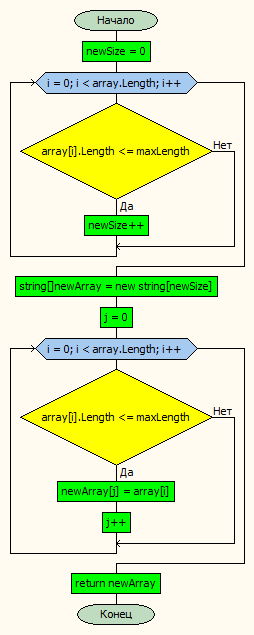

# Итоговая проверочная работа #

## Описание программы решения задачи ##

Данная программа фильтрует массив строк по заданному условию и формирует новый массив из строк, длина которых меньше или равна заданному числу.

В методе ***'task'*** вызываются три вспомогательных метода: ***'ReadArrayFromInput'***, ***'FilterArrayByLength'*** и ***'PrintArray'***.

Метод ***'ReadArrayFromInput'*** запрашивает у пользователя ввод исходного массива строк, разделенных пробелом, и возвращает этот массив.

Метод ***'FilterArrayByLength'*** принимает на вход исходный массив строк и максимальную длину строки, которую необходимо сохранить. Метод проходит по каждому элементу массива и проверяет его длину. Если длина элемента меньше или равна максимальной длине, то увеличивает счетчик нового массива ***'newSize'***. Затем создается новый массив ***'newArray'*** заданного размера и заполняется нужными элементами из исходного массива. Наконец, метод возвращает новый массив.

## Блок-схема главного метода программы *'FilterArrayByLength'* ##

Метод ***PrintArray*** принимает на вход массив строк и выводит его элементы в консоль, разделяя их пробелом.

В методе ***task*** сначала вызывается метод ***ReadArrayFromInput***, который запрашивает у пользователя исходный массив строк. Затем вызывается метод ***FilterArrayByLength***, который формирует новый массив строк, содержащий только элементы, длина которых меньше или равна 3. Наконец, метод ***PrintArray*** выводит новый массив в консоль.